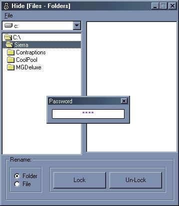



## File Lock

### Description

This code is based on the Windows 95, Windows 98, and Windows 98 Second Edition glitch in file viewing. Be very careful with this tool for if you lock the folder that contains the program, the program will not run. For example if this program is in your C:\Program Files\Lock\ folder and you lock Program Files the program will not run. There a few safety features. First you need to create a shortcut to the EXE (when you compile it or just rem the line in the frmLoad Form_Load section that checks for the Command$). Create a shortcut to the EXE and give it a command line of shortcut. (If you edit the properties of the shortcut file and find the location of the program. at the end of that add "shortcut" without quotes). Next your mouse needs to be in the upper left hand corner of the screen at co-ordinates 0,0. I would suggest giving the shortcut a "hot key" or using the keyboard to open it. Without the command line "shortcut" and the mouse being in the upper left hand corner of the screen the password box will not appear. Now the initial password (default) is "maxx" without the quotes. Once in the program you can change the password. You can always delete the string from the registry and the password will default back to maxx. The file/folder locking feature is due to windows 98se and belows glitch. DOS can read characters windows can not. So by going in dos and using an ALT code to rename a file/folder it will rename it. However windows will not be able to read the alt code and will give the file/folder an underscore. You will not be able to open/explore or delete the locked folder/file. In my program I use the alt code of alt+0254 or chr$(254).

If for some reason you mess up a file or folder and the program can not rename it or if you locked the program itself you can manually fix it. Either load a dos prompt or restart in dos. The command used to rename files in DOS is REN or RENAME. The format for ren or rename is the same and goes as follows.

REN (Source Path and File Name) (New File Name)

for example:

REN C:\Clever.txt Smart.txt

this will rename the file Clever to Smart. To get rid of the lock you will need to use alt plus the number-pad. Lets say clever was locked. You would need to do this REN C:\Clever(hold alt and press 0254).txt Clever.txt When you hold alt and press 0254 it will insert a box, that is the alt code. When you hit enter the file/folder should be renamed and everything should be okay.
 
### More Info
 

             |
---                |---
**Submitted On**   |2003-03-26 03:26:42
**By**             |[not sure unknown](https://github.com/Planet-Source-Code/PSCIndex/blob/master/ByAuthor/not-sure-unknown.md)
**Level**          |Advanced
**User Rating**    |4.0 (8 globes from 2 users)
**Compatibility**  |VB 6\.0
**Category**       |[Files/ File Controls/ Input/ Output](https://github.com/Planet-Source-Code/PSCIndex/blob/master/ByCategory/files-file-controls-input-output__1-3.md)
**World**          |[Visual Basic](https://github.com/Planet-Source-Code/PSCIndex/blob/master/ByWorld/visual-basic.md)
**Archive File**   |[File\_Lock1565743282003\.zip](https://github.com/Planet-Source-Code/not-sure-unknown-file-lock__1-44328/archive/master.zip)

